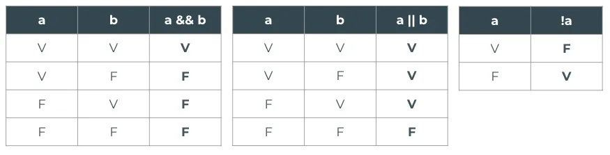

# Resumo do bloco: Javascript

- Entradas e saídas do nosso código (console.log e prompt)
    
    <aside>
     **Saídas → console.log()**
    
    Quando queremos **testar** alguma operação do nosso código, precisamos que ele nos dê uma saída, que vai ser a resposta do código pra gente saber se deu tudo certo.
    
    Vamos supor que meu código realize uma soma e que eu queira ver o resultado. Para isso, utilizamos o `console.log()`, que irá imprimir no console do navegador o resultado da conta.
    
    ```jsx
    const a = 3
    const b = 5
    const soma = a + b
    
    // A linha abaixo nos permite VER o resultado para testar se a conta 
    // deu certo
    console.log("Resultado da soma:", soma) 
    ```
    
    </aside>
    
    <aside>
    **Entradas do Usuário → prompt()**
    
    Muitas vezes em nossos sites, a gente vai querer que o usuário consiga inserir dados para a gente fazer alguma operação. Para isso, utilizamos o `prompt()`.
    
    O prompt recebe um texto escrito pelo usuário. Esse texto sempre vem no formato de uma **string**. Podemos guardar esse texto em uma variável e utilizá-lo como quisermos.
    
    Para realizar contas, precisamos converter a string para um número, utilizando o método `Number()`. Abaixo, temos um exemplo de soma com entradas feitas pelo usuário:
    
    ```jsx
    const a = prompt("Insira o primeiro número da soma")
    const b = prompt("Insira o segundo número da soma")
    const soma = Number(a) + Number(b)
    
    console.log("Resultado da soma:", soma)
    ```
    
    </aside>
    
    Para ver esses conceitos na prática, você pode assistir ao vídeo abaixo:
    
    [Entradas e saídas - console.log()/prompt()](https://www.loom.com/share/4c9f73d5b4c74e05949675f5a3fdd0eb)
    
- Variáveis
    
    <aside>
   **O que é uma variável?**
    
    Variáveis são como caixinhas que nos permitem guardar informações dentro delas para acessar quando precisarmos.
    
    Os dados guardados dentro delas podem ser de qualquer tipo (números, strings, arrays, booleanos...).
    
    </aside>
    
    <aside>
   **Criando uma variável**
    
    Precisamos escolher um nome para a variável. Esse nome precisa ser bem claro e significativo para sabermos o que vai ter dentro dessa caixinha.
    
    Escrevemos esse nome em **camelCase** (primeira letra minúscula, e toda vez que muda de palavra, coloca maiúscula 🐫 ).
    
    As variáveis podem ser de dois tipos:
    
    - `const`: não permite mudança posterior no valor
    - `let`: permite mudança posterior no valor
    
    ```jsx
    const nomeBruxa = "Morgana" // Este valor não pode mudar!
    let idadeBruxa = 6000       // Este valor pode mudar!
    
    // Mudando o valor de uma variável declarada como let:
    idadeBruxa = 6001 
    ```
    
    </aside>
    
- Operadores Aritméticos
    
    <aside>
   **Operadores Aritméticos**
  
    São utilizados para realizar cálculos matemáticos entre valores numéricos. Temos:
    
    **Soma** (**+**)  → realiza a adição de valores numéricos
    
    ```jsx
    const numero1 = 10
    const numero2 = 20
    
    const soma = numero1 + numero2
    //A soma será igual a 30
    ```
    
    **Subtração** (**-**)  ****→ realiza a subtração de valores numéricos
    
    ```jsx
    const numero1 = 30
    const numero2 = 15
    
    const subtracao = numero1 - numero2
    //A subtração será igual a 15
    ```
    
    **Multiplicação** (*****) ****→ realiza a multiplicação de valores numéricos
    
    ```jsx
    const numero1 = 10
    const numero2 = 20
    
    const multiplicacao = numero1 * numero2
    //A multiplicação será igual a 200
    ```
    
    **Divisão** ( **/** )→ realiza a divisão de valores numéricos
    
    ```jsx
    const numero1 = 30
    const numero2 = 15
    
    const divisao = numero1 / numero2
    //A divisao será igual a 2
    ```
    
    **Módulo** (**%**) ****→ devolve o resto da divisão entre valores inteiros
    
    ```jsx
    const numero1 = 3
    const numero2 = 2
    
    const modulo = numero1 % numero2
    //O módulo será igual a 1
    ```
    
    </aside>
    
- Operadores de Comparação
    
    <aside>
   **Operadores de Comparação**
    
    Funcionam como uma pergunta de verdadeiro ou falso, ou seja, o resultado é TRUE ou FALSE (valores booleanos).
    
    Os dois primeiros que veremos servem para qualquer tipo de variável:
    
    - `===`  → verifica se os dois lados da comparação possuem o mesmo **valor** e **tipo** (ou seja, verifica se ambos são números, ou ambos são strings, etc)
    - `!==`  → verifica se valor ou tipo dos dois lados da comparação são diferentes
    
    Também temos alguns operadores que servem para comparar valores numéricos:
    
    - `>`   → maior que
    - `<`   → menor que
    - `>=` → maior ou igual a
    - `<=` → menor ou igual a
    
    Abaixo temos alguns exemplos de quais resultados cada comparação retornaria:
    
    ```jsx
    1 === 1   // true, pois o valor e o tipo são iguais
    1 === '1' // false, pois o TIPO é diferente (número e string)
    1 === 2   // false, pois o VALOR é diferente
    1 !== 2   // true
    1 > 2     // false
    1 < 2     // true
    1 >= 2    // false
    1 <= 2    // true
    ```
    
    </aside>
    
- Operadores Lógicos
    
    <aside>
   **Operadores Lógicos**
    
    Devem ser utilizados entre valores booleanos e retornam também um true ou false. Caso o valor não seja booleano, ocorre algo chamado **coerção de tipo**, conteúdo a ser tratado futuramente no curso. 
    
    **Operador &&** → representa a palavra E (ou AND, em inglês). O resultado da operação somente será **verdadeiro** quando os elementos envolvidos forem **todos verdadeiros**.
    
    ```jsx
    const variavel1 = 2 > 5   // false
    const variavel2 = 1 === 1 // true
    
    variavel1 && variavel2    // false
    ```
    
    **Operador ||** → representa a palavra OU (ou OR, em inglês). O resultado da operação somente será **falso** se todos os elementos envolvidos **forem falsos**.
    
    ```jsx
    const variavel1 = 2 > 5   // false
    const variavel2 = 1 === 1 // true
    
    variavel1 || variavel2    // true
    ```
    
    **Operador !** → representa uma negação (ou NOT, em inglês). Retorna o booleano oposto, é possível ver esse operador como um inversor de valores (o que é verdadeiro vira falso e o que é falso vira verdadeiro)
    
    ```jsx
    const variavel1 = 'amor' === 'amor' // true
    const variavel2 = 10 === 10         // true
    
    !variavel1 && variavel2 // false
    
    // !variavel1 = false
    // variavel2 = true
    // false && true → false
    ```
    
    </aside>
    
    Para resumir, você pode consultar essas 3 tabelinhas:
    
    
    
- Strings
    
    <aside>
   **O que são strings?**
    
    Strings são os tipos que representam textos. Existem 3 maneiras de declararmos uma string:
    
    - Com aspas duplas: `"Olá!"`
    - Com aspas simples: `'Oi!'`
    - Com crases: ``Oiee!``
    
    Não há diferença entre aspas simples ou duplas, mas as strings criadas com **crases** são especiais: elas se chamam **template strings** e permitem que a gente coloque **variáveis javascript** no meio do texto:
    
    ```jsx
    const nome = prompt("Qual é o seu nome?")
    const idade = prompt("Quantos anos você tem?")
    
    // Template string com variáveis ⬇
    const apresentacao = `Meu nome é ${nome} e tenho ${idade} anos`
    // Isso só funciona se a string for declarada entre crases! ``
    ```
    
    </aside>
    
    <aside>
  **Protótipo de String**
    
    O javascript nos fornece algumas propriedades e métodos para strings. Existem vários, mas apresentamos alguns deles para você:
    
    **Propriedades:** valores relacionados à string
    
    - `length` → devolve o tamanho de uma string, contando os espaços
    
    **Métodos:** ações que podem ser realizadas na string
    
    - `toLowerCase()` → Faz todas as letras da string serem minúsculas
    - `toUpperCase()` → Faz todas as letras da string serem maiúsculas
    - `trim()` → Retira espaços que estejam "sobrando" no início e no fim da string
    - `includes("pal")` → Verifica se uma palavra está naquela string, retorna true / false
    - `replaceAll("a", "b")` → Substitui todas as ocorrências de uma palavra por outra
    
    ```jsx
    const frase = " Bom Dia! "
    
    frase.length //--------------------------> 10
    frase.toLowerCase() //-------------------> " bom dia! "
    frase.toUpperCase() //-------------------> " BOM DIA! "
    frase.trim() //--------------------------> "Bom Dia!"
    frase.includes("Bom") //-----------------> true
    frase.includes("Péssimo") //-------------> false
    frase.replaceAll("Bom", "Excelente") //--> " Excelente Dia! "
    ```
    
    </aside>
    
- Arrays
    
    <aside>
   **O que são Arrays?**
    
    Arrays são **listas**. Essas listas podem possuir itens de qualquer tipo dentro delas (textos, números, etc). 
    
    Para declarar um array, utilizamos os colchetes; são eles que agrupam os itens da lista:
    
    ```jsx
    const listaCompras = ["banana", "batata", "leite", "arroz"]
    ```
    
    Para acessar um item da lista, nós utilizamos a sua **posição**, sendo que a contagem das posições se inicia no número 0.
    
    ```jsx
    const listaCompras = ["banana", "batata", "leite", "arroz"]
    // Posições							  0         1        2        3
    
    // Para acessar a string "leite", utilizamos a sintaxe abaixo ⬇
    const itemDaLista = listaCompras[2]
    ```
    
    </aside>
    
    <aside>
  
    
    **Protótipo de Array**
    
    O javascript nos fornece algumas propriedades e métodos para arrays. Existem vários, mas apresentamos alguns deles para você:
    
    **Propriedades:** valores relacionados ao array
    
    - `length` → devolve a quantidade de itens que a lista possui
    
    **Métodos:** ações que podem ser realizadas no array
    
    - `push("item")` → Adiciona o item no final da lista
    - `pop()` → Remove o último item da lista
    - `includes("item")` → Verifica se um item está naquela lista, retorna true / false
    - `splice(i, n)` → Remove **n** elementos à partir da posição **i** do array
    
    ```jsx
    const lista = [1, 2, 3, 4]
    
    lista.length //--------------------> 4
    lista.push(5) //-------------------> [1, 2, 3, 4, 5]
    lista.pop() //---------------------> [1, 2, 3]
    lista.includes(2) //---------------> true
    lista.includes(6) //---------------> false
    frase.splice(2, 1) //--------------> [1, 2, 4]
    ```
    
    </aside>
    
- Objetos
    
    <aside>
  **O que é um objeto?**
    
    Em javascript, um objeto é uma entidade com propriedades. Compare-o com uma xícara, por exemplo. Uma xícara é um objeto, com propriedades. Uma xícara tem uma cor, um peso, um material de composição, etc. 
    
    Da mesma forma, objetos em javascript podem ter propriedades, e essas propriedades definem suas características.
    
    ```jsx
    const xicara = {
    	cor: "azul",
      peso: 0.5,
      material: "cerâmica"
    }
    ```
    
    **Propriedades**: são compostas por duas partes → uma **chave** e um **valor**.
    
    - Chave é o **nome** da propriedade (no exemplo acima: `cor`, `peso`, `material`)
    - Valor é o que está "**dentro**" daquela propriedade (`"azul"`, `0.5`, `"cerâmica"`)
    
    **Acessando valores dentro do objeto**
    
    Vamos continuar usando o exemplo da xícara. 
    
    Suponha que você tem essa xícara descrita no objeto acima e eu te pergunte: qual é a **cor** da sua xícara? Você me responderia: **azul**. O que você fez foi **acessar** a propriedade `cor` do seu objeto `xicara`. 
    
    Como fazemos isso no javascript? Existem dois jeitos:
    
    - **Notação de ponto** → `xicara.cor` → `nomeDoObjeto.chave`
    - **Notação de colchete** → `xicara["cor"]` → `nomeDoObjeto["chave"]`
    </aside>
    
- Spread Operator ou Sintaxe de Espalhamento ("três pontinhos" → ... )
    
    <aside>
  **Spread Operator**
    Serve para pegar todos os elementos que estão dentro de um array ou todas as propriedades que estão dentro de um objeto.
    
    Usamos essa sintaxe principalmente para fazer **cópias** de objetos ou arrays! Dos casos apresentados aqui, esse será o mais comum:
    
    ```jsx
    // Copiando os elementos de um array (original) dentro de um novo array
    // (copia)
    const original = [1, 2, 3]
    const copia = [...original] // Novo array com os elementos 1, 2, 3
    
    // Cópia de um objeto
    const pet = {
    	nome: "Polly",
      tipo: "cachorro",
      cor: "areia"
    }
    
    const copiaPet = {...pet} // Novo objeto com as mesmas propriedades
    ```
    
    Outro caso de uso menos comum em arrays é pegar todos os elementos de um array, adicioná-los a um array novo juntamente com outros novos elementos:
    
    ```jsx
    // Supondo que temos um array de números pares:
    const numerosPares = [2, 4, 6, 8, 10]
    
    // Agora vamos criar um array que contém todos os números de 1 a 10
    // Podemos pegar os números pares já descritos no array numerosPares
    // E aí apenas precisamos adicionar os elementos que faltaram!
    const numerosAteDez = [...numerosPares, 1, 3, 5, 7, 9] 
    ```
    
    E no caso de objetos, podemos **reaproveitar** propriedades que são iguais entre dois objetos diferentes e alterar apenas aquelas que precisam ser mudadas:
    
    ```jsx
    // Podemos fazer uma cópia de tudo que está dentro do objeto
    // E então mudar apenas as propriedades que desejarmos
    const rebeca = {
    	nome: "Rebeca Andrade",
      nacionalidade: "Brasileira",
      esporte: "Ginástica Olímpica"
    }
    
    // Se quisermos criar um objeto para Daiane dos Santos, temos que 
    // a nacionalidade e o esporte são iguais aos da Rebeca, basta mudar 
    // o nome!
    const daiane = {
    	...rebeca,
    	nome: "Daiane dos Santos"
    }
    ```
    
    </aside>
    
- Condicionais (if/else e switch/case)
    
    <aside>
  **O que são condicionais?**
    
    Condicionais são estruturas do código que nos permitem tomar decisões a partir de uma outra informação. Já tomamos essas decisões diariamente em nossas vidas! Por exemplo:
    
    - SE estiver chovendo, devo pegar o guarda-chuva antes de sair de casa
    - SE tiver ovos na geladeira posso fazer um bolo. SENÃO preciso ir ao mercado
    
    Quando estamos falando de código, alguns exemplos poderiam ser:
    
    - SE o número de vidas do jogador for 0, o jogo termina
    - SE a pessoa tiver mais de 1,50m, imprimir uma mensagem permitindo que ela entre em um brinquedo do parque. SENÃO, não permitir
    - SE o restaurante estiver aberto, permita que o usuário adicione itens no carrinho. SENÃO mostre um alerta informando o horário de abertura do restaurante
    
    Para fazer essas decisões, utilizaremos duas sintaxes de código possíveis:
    
    - if / else
    - switch / case
    </aside>
    
    <aside>
   **Sintaxe: if / else**
    
    - **if** → representa a palavra SE. Caso a condição seja verdadeira, o código presente no bloco IF é executado
    - **else** → representa a palavra SENÃO. Caso a condição seja falsa, o código do bloco ELSE é executado
    
    Vamos ver como isso funcionaria no exemplo acima da altura mínima para entrar no brinquedo:
    
    ```jsx
    if (altura >= 1.5){
    	console.log("Você pode entrar no brinquedo! :D")
    } else {
    	console.log("Você NÃO PODE entrar no brinquedo :(")
    }
    ```
    
    </aside>
    
    <aside>
  **Sintaxe: switch / case**
    
    O switch / case é uma condicional especial que verifica apenas IGUALDADE. Ele vai checar se uma determinada variável é IGUAL à uma lista de valores.
    
    Caso seja igual a algum dos valores determinados, executará o trecho de código determinado para aquele caso. Se não cair em nenhum dos casos listados, executará a ação do caso `default` (padrão).
    
    Também é importante lembrar de usar a palavra `break` ao fim de cada um dos casos, senão o código irá executar tudo o que estiver abaixo do case correto (a palavra `break` QUEBRA o fluxo do código naquele ponto, assim ele não executará todos os casos, apenas aquele que é o correto).
    
    ```jsx
    switch (pais){
    	case "Brasil": // Caso pais seja IGUAL à Brasil
    		console.log("Brasileiro(a)") // Ação executada se pais for Brasil
    		break
    	case "EUA":
    		console.log("Estadunidense")
    		break
    	case "Canadá":
    		console.log("Canadense")
    		break
    	default:
    		// Ação a ser executada se pais for diferente de Brasil, EUA ou 
    		// Canadá
    		console.log("Nacionalidade não identificada")
    		break
    }
    ```
    
    </aside>
    
- Laços (while, for, for...of e for…in)
    
    <aside>
  **O que são laços?**
    
    Laço é o nome que damos para estruturas de **repetição** no nosso código.
    
    Utilizamos essas estruturas quando queremos repetir alguma ação por um tempo. Para isso, é necessário termos:
    
    - Uma ação a ser repetida
    - Um incremento (para saber quantas vezes a ação repetiu)
    - Uma condição de parada (depois de quantas vezes a ação deve parar de ser repetida)
    
    Existem diversas sintaxes de laços, vimos por hora três delas:
    
    - while
    - for
    - for... of (exclusiva para arrays)
    - for… in (exclusiva para objetos e arrays)
    </aside>
    
    <aside>
   **Sintaxe: while**
    
    - Loop mais abrangente e personalizável
    - Permite que a nossa condição de parada seja um booleano
    - É necessário gerenciar manualmente o incremento e tomar cuidado com a condição de parada
    
    Vamos fazer um exemplo simples: vamos imprimir todas as posições de um array
    
    ```jsx
    const array = ["azul", "vermelho", "amarelo"]
    let i = 0
    
    while(i < array.length){
    	console.log(`Item ${i}: ${array[i]}`)
      i++
    }
    
    // O que veremos no console 👇👇👇
    // Item 0: azul
    // Item 1: vermelho
    // Item 2: amarelo
    ```
    
    </aside>
    
    <aside>
    **Sintaxe: for**
    
    - Funciona de forma parecida com o while, mas nossa condição de parada está necessariamente atrelada ao número de vezes que o loop rodou
    - A declaração da variável de iterações (i) e o seu incremento são feitos na linha de declaração do for, o que facilita esse processo e nos ajuda a não esquecer esses dois pontos
    
    Vamos fazer o mesmo exemplo anterior, só que utilizando for:
    
    ```jsx
    const array = ["azul", "vermelho", "amarelo"]
    
    for(let i = 0; i < array.length; i++){
    	console.log(`Item ${i}: ${array[i]}`)
    }
    
    // O que veremos no console 👇👇👇
    // Item 0: azul
    // Item 1: vermelho
    // Item 2: amarelo
    ```
    
    </aside>
    
    <aside>
   **Sintaxe: for...of**
    
    - Funciona apenas para arrays
    - Dá um nome para cada item do array
    - Não temos acesso fácil ao índice dos itens
    
    Vamos fazer o mesmo exemplo anterior, só que utilizando for...of:
    
    ```jsx
    const array = ["azul", "vermelho", "amarelo"]
    
    for(let cor of array){ // o nome de cada item, nesse caso, é **cor**
    	// Como não temos acesso ao índice, vamos imprimir apenas 
      // o que está escrito em cada item (azul, vermelho e amarelo)
    	console.log(cor)
    }
    
    // O que veremos no console 👇👇👇
    // azul
    // vermelho
    // amarelo
    ```
    
    </aside>
    
    <aside>
    **Sintaxe: for...in**
    
    - Funciona apenas para objetos e arrays
    - Temos acesso ao **índice** (em arrays) ou às **chaves** das propriedades (em objetos)
    
    Vamos fazer o mesmo exemplo anterior, só que utilizando for...in:
    
    ```jsx
    const array = ["azul", "vermelho", "amarelo"]
    
    for(let indice in array){
    	console.log(`Item ${indice}: ${array[indice]}`)
    }
    
    // O que veremos no console 👇👇👇
    // Item 0: azul
    // Item 1: vermelho
    // Item 2: amarelo
    ```
    
    Agora, um exemplo com objeto:
    
    ```jsx
    const cores = {
      corPrimaria: 'azul',
      corSecundaria: 'verde',
      corTerciaria: 'azul-esverdeado'
    }
    
    for (let chave in cores) {
    	console.log(`O valor da propriedade ${chave} é ${cores[chave]}`)
    }
    
    // O que veremos no console 👇👇👇
    // O valor da propriedade corPrimaria é azul 
    // O valor da propriedade corSecundaria é verde 
    // O valor da propriedade corTerciaria é azul-esverdeado
    ```
    
    </aside>
    
- Funções
    
    <aside>
   **O que são Funções?**
    
    Uma função é um **bloco de código** que tem como objetivo executar uma tarefa. Para que esse código seja executado, ele precisa ser invocado à partir do seu nome.
    
    É possível construir seu código inteiro sem criar nenhuma função, entretanto elas deixam nosso código mais organizado e menos repetitivo.
    
    Vamos supor que eu quero fazer no meu código várias vezes a operação de somar dois números. É interessante colocar esse código em uma função para que eu possa reutilizar quantas vezes precisar!
    
    ```jsx
    function somaDoisNumeros (num1, num2) {
    	const resultado = num1 + num2
    	return resultado
    }
    
    const res1 = somaDoisNumeros(2, 3) // primeiro exemplo
    const res2 = somaDoisNumeros(4, 2) // segundo exemplo
    const res3 = somaDoisNumeros(9, 1) // terceiro exemplo
    ```
    
    </aside>
    
    <aside>
     **Partes de uma função**
    
    **Entrada** ou **Parâmetros** (opcional): caso a sua função receba valores que variam, esses serão os parâmetros, a entrada da função. Você precisa explicitar o que a sua função espera receber e dar nomes para essas coisas, que funcionarão como variáveis que apenas serão acessíveis dentro da sua função.
    
    ```jsx
    function somaDoisNumeros (num1, num2) {
    	const resultado = num1 + num2
    	return resultado
    }
    ```
    
    No exemplo da soma, dissemos que a nossa função receberá duas "variáveis", uma chamada `num1` e outra chamada `num2`. Os valores dessas variáveis são determinados no momento em que chamamos essa função.
    
    No primeiro exemplo, `num1 = 2` e `num2 = 3`.
    No segundo exemplo, `num1 = 4` e `num2 = 2`.
    No terceiro exemplo, `num1 = 9` e `num2 = 1`.
    
    Ou seja: a ordem em que colocamos os parâmetros na hora de chamar a função importa! Se o primeiro exemplo de chamada a gente fizesse `somaDoisNumeros(3, 2)` ao invés de `somaDoisNumeros(2, 3)`, teríamos que: `num1 = 3` e `num2 = 2`
    
    **Corpo**: código que será executado. É aqui que você coloca tudo aquilo que você quer que seja executado quando a função é chamada, e o computador executará tudo que estiver dentro das chaves
    
    ```jsx
    function somaDoisNumeros (num1, num2) {
    	const resultado = num1 + num2
    	return resultado
    }
    ```
    
    **Saída** ou **Retorno** (opcional): caso sua função possua um resultado, esse pode ser o retorno dela. Isso serve para que aquilo que você criou dentro da função seja **acessível fora dela**. Ou seja: no exemplo da soma, nós calculamos um valor. Esse valor só existe dentro das chaves da função. Se quisermos acessá-lo em outro lugar do nosso código, precisamos utilizar o comando `return` e guardar esse valor em uma variável ao executar a função. 
    
    ```jsx
    function somaDoisNumeros (num1, num2) {
    	const resultado = num1 + num2
    	return resultado
    }
    
    // Ao chamar a função, criamos variáveis para guardar o valor retornado
    // Nesse caso são as variáveis: res1, res2 e res3
    const res1 = somaDoisNumeros(2, 3) // res1 será 5
    const res2 = somaDoisNumeros(4, 2) // res2 será 6
    const res3 = somaDoisNumeros(9, 1) // res3 será 10
    ```
    
    </aside>
    
    <aside>
   **Declaração de funções**
    
    A função pode ser declarada de 3 jeitos, todos funcionam de forma semelhante:
    
    ```jsx
    function somaDoisNumeros (num1, num2) {
    	return num1 + num2
    }
    
    const somaDoisNumeros = function (num1, num2){
    	return num1 + num2
    }
    
    const somaDoisNumeros = (num1, num2) => {
    	return num1 + num2
    }
    ```
    
    </aside>
    
- Funções de Array (map e filter)
    
    <aside>
   **O que são Funções de Array?**
    
    São funções que só podem ser aplicadas a elementos do tipo array e que realizam alguma operação nos itens desse array. 
    
    Existem várias (que você pode encontrar [aqui](https://developer.mozilla.org/pt-BR/docs/Web/JavaScript/Reference/Global_Objects/Array#)), mas focamos em trazer duas que são muito úteis para começar: `filter` e `map`
    
    </aside>
    
    <aside>
  **filter**
    
    - A função filter irá passar por todos os itens do array, um por um
    - Ele é utilizado para filtrar itens, ou seja: ele irá criar um novo array com **alguns elementos do array original** (**ou todos**, depende da regra!), **sem modificá-los**, mas apenas selecionando-os de acordo com a regra escolhida por você
    
    Por exemplo: vamos supor que temos um array com produtos de uma feira:
    
    ```jsx
    const produtos = [
    	{ nome: "banana", preco: 2, categoria: "fruta"},
    	{ nome: "batata", preco: 3, categoria: "legume" },
    	{ nome: "abóbora", preco: 6, categoria: "legume" },
    	{ nome: "maçã", preco: 3, categoria: "fruta" },
    	{ nome: "morango", preco: 8, categoria: "fruta" },
    ]
    ```
    
    Poderíamos filtrar esse array seguindo vários critérios! Por exemplo:
    
    - Mostrar apenas as frutas
    - Mostrar apenas os legumes
    - Mostrar apenas os produtos com preço menor do que 5
    - Mostrar apenas os produtos que começam com a letra b
    - ... etc
    
    Para dar um exemplo, vamos fazer uma filtragem que nos retorne um array que possui apenas os itens da categoria fruta:
    
    ```jsx
    const frutas = produtos.filter((item) => {
    	return item.categoria === "fruta"
    })
    
    // Essa operação irá criar o seguinte array:
    // [
    //  { nome: "banana", preco: 2, categoria: "fruta"},
    //	{ nome: "maçã", preco: 3, categoria: "fruta" },
    //	{ nome: "morango", preco: 8, categoria: "fruta" }
    // ]
    ```
    
    </aside>
    
    <aside>
   **map**
    
    - A função map irá passar por todos os itens do array, um por um
    - O resultado dessa função é um novo array que contém **o mesmo número de elementos** que o array inicial
    - O map é utilizado quando queremos pegar todos os itens de um array e **modificá-los** de alguma forma para criar um array novo com as modificações
    
    Por exemplo: vamos supor que temos um array com produtos de uma floricultura:
    
    ```jsx
    const produtos = [
    	{ nome: "margarida", preco: 5 },
    	{ nome: "tulipa", preco: 10 },
    	{ nome: "rosa", preco: 15 },
    ]
    ```
    
    Agora suponha que está chegando a Black Friday e a floricultura quer dar um desconto de 10% em todas as flores. Podemos criar um novo array com o preço alterado utilizando o map:
    
    ```jsx
    const produtosComDesconto = produtos.map((flor) => {
    		return {...flor, preco: flor.preco*0.9}
    })
    
    // Essa operação irá criar o seguinte array:
    // [
    //   { nome: "margarida", preco: 4.5 },
    // 	 { nome: "tulipa", preco: 9 },
    //	 { nome: "rosa", preco: 13.5 }
    // ]
    ```
    
    </aside>