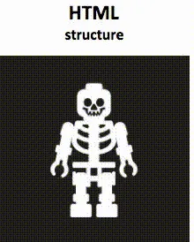
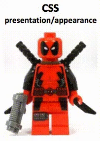
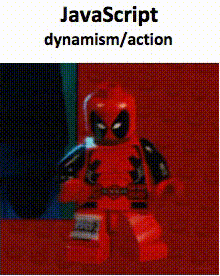
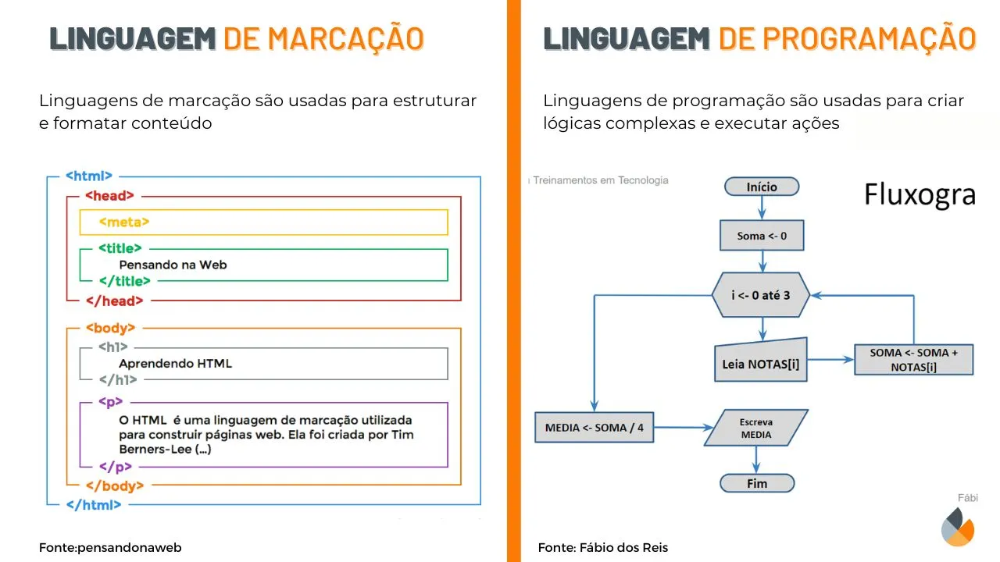
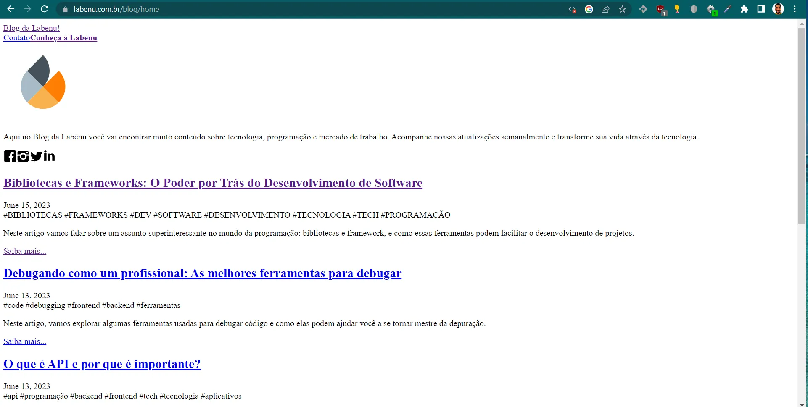
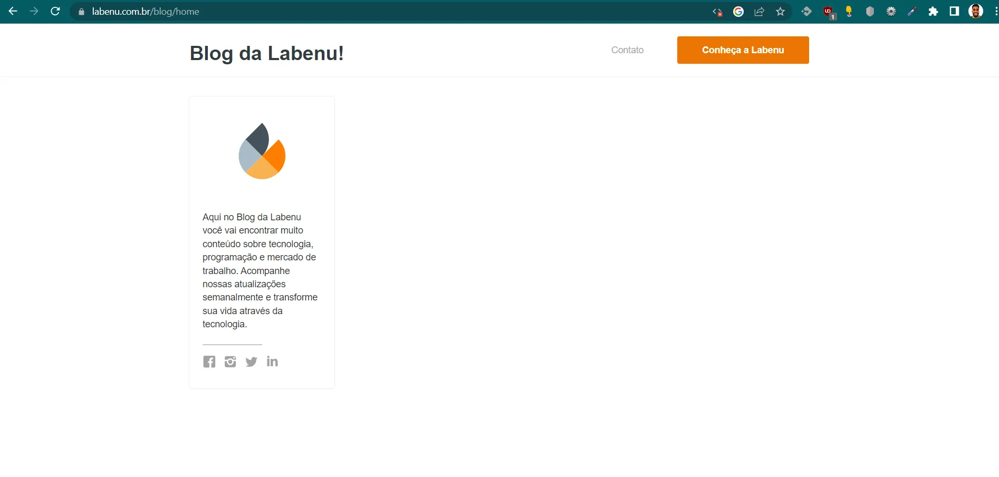

# Introdução a HTML: Marcação x Programação

**HTML** significa HyperText Markup Language, ou Linguagem de Marcação de HiperTexto, em tradução livre. HTML, CSS e JavaScript são as linguagens que comandam a web. Elas são complementares, cada uma desenhada para fazer um conjunto específico de tarefas.

**HTML** é a estrutura básica da página web, fornecendo a hierarquia e organização dos elementos na página.

**CSS** é responsável pela aparência visual da página, definindo as propriedades estilísticas dos elementos HTML.

**JavaScript** permite que a página responda a eventos do usuário e manipule dinamicamente o conteúdo e a aparência da página.

O HTML é uma linguagem de marcação, e **define o conteúdo de todas as páginas da internet**. Ao “marcar” seu conteúdo **(texto, imagens, vídeos, etc)** com tags HTML, você consegue contar para os navegadores de internet como você quer que diferentes partes do seu conteúdo **sejam exibidas**.

Observe a seguir o esquema linguagens de marcação X linguagens de programação.

## Exemplo do site da Labenu

Vamos refletir sobre a importância de cada uma dessas tecnologias, utilizando o [site da Labenu](https://www.labenu.com.br/blog/home) como exemplo em **três situações distintas**:

1. O site somente com HTML.
2. HTML + CSS.
3. HTML + CSS + JavaScript.

## **Somente HTML**

## HTML + CSS

### HTML + CSS + JavaScript

# Resumo

1. HTML, CSS e JavaScript são linguagens complementares que comandam a web, cada uma com um conjunto específico de tarefas.
2. HTML é responsável pela estrutura básica da página web, fornecendo hierarquia e organização dos elementos.
3. CSS é responsável pela aparência visual da página, definindo as propriedades estilísticas dos elementos HTML.
4. JavaScript permite a resposta a eventos do usuário e a manipulação dinâmica do conteúdo e aparência da página.
5. HTML é uma linguagem de marcação que define o conteúdo das páginas da web, permitindo marcar diferentes partes para exibição pelos navegadores de internet.