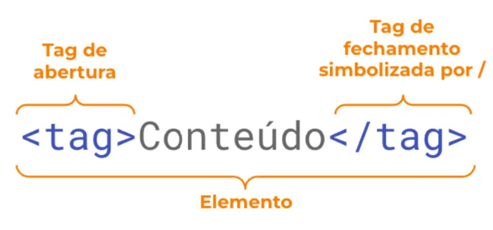
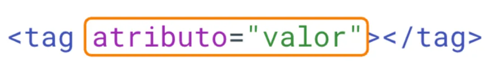
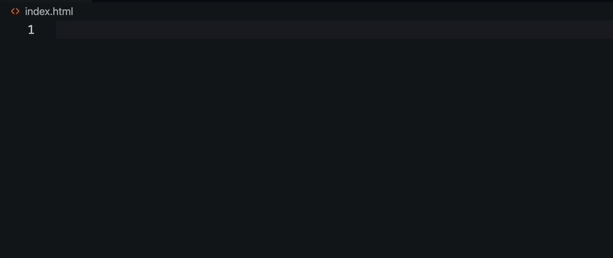
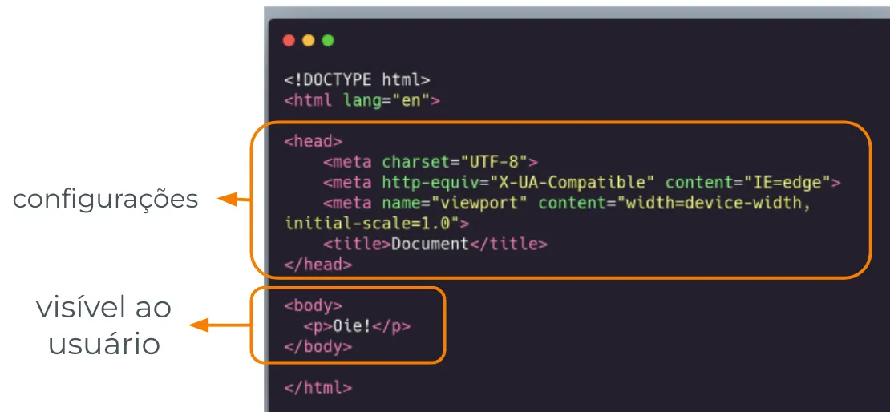

# HTML - Tag, Estrutura e tipos de elementos

# HTML - tags, atributos e hierarquia

- Pode ser escrito em qualquer editor de texto (VSCode, bloco de notas)
- Definimos a extensão do arquivo como .html
- É executado diretamente no navegador

## TAG

A marcação dos textos em HTML é feita por meio de tags

Por exemplo:

```html
**<tag>**Conteúdo**</tag>**
```



## Atributos

- Tags podem ter atributos que definem o comportamento ou a característica de um elemento
- Devem ser colocados na tag de abertura, após o nome da tag

```html
<tag **atributo="valor"**></tag>
```



## Hierarquia

Tags respeitam uma hierarquia e podem ser aninhadas

```html
<tag-pai atributo="valor">
  <tag-filha atributo2="valor2">
        Conteúdo
    </tag-filha>
</tag-pai>
```

Agora que você já sabe um pouco sobre tag, vamos seguir falando sobre sua estrutura básica e tipos de elementos!

# **Estrutura Básica**

Para a **estrutura** do arquivo HTML, precisamos escrever algumas configurações iniciais,  para ajudar nosso navegador a ler nossos arquivos. Para isso, vamos assumir que temos um arquivo chamado `index.html` criado para ser nossa página inicial. Com isso, feito, sempre faremos algo parecido com o que está no exemplo de código abaixo:

<aside>
💡 **index** é “índice” em inglês, e costuma ser o nome da nossa página principal. Muitos sistemas procuram arquivos chamados index.html para abrir automaticamente.

</aside>

```html
<!DOCTYPE html>
<html>
  <head>
    <!-- Informações, links com arquivos, e metadados vão aqui -->
  </head>
  <body>
    <!-- O conteúdo visível vai aqui -->
  </body>
</html>
```

Primeiro, precisamos dizer para o navegador que estamos tratando de um arquivo da última versão HTML, o **HTML5**. Para isso, usamos o `<!DOCTYPE html>` no começo do nosso arquivo. Isso permite que coisas que só existem no HTML5 sejam exibidas no navegador.

Depois disso,  nossa página precisa ser envolvida nas tags `<html>`. Tudo entre as tags `<html>` e `</html>` será nossa página.

- Assim, todo documento html inicia com uma estrutura básica padrão, contendo tags essenciais que definem:

https://whimsical.com/RgngzjeA9uXZS8Y4EgTsSH@2Ux7TurymNB6q35XkBmt

### <head>

- Configurações da página
- Título do site
- Links com docs externos

### <body>

- Conteúdo do site

<aside>
💡 Dica: No VSCode temos um atalho para criar essa estrutura básica!

</aside>



### **Estrutura básica: `<head>`**

- Contém informações de **configuração do site**
    - **Tags metas:** São dados que **não são visíveis ao usuário**, importantes para o trabalho de **buscadores e acessibilidade**
    - **Título:** Título da página
    - **Link:** Tag **link** que permite **relacionar** (linkar) o documento HTML com outro documento externo (.css ou .js)

### **Estrutura básica: `<body>`**

- É a parte que contém o **corpo** do site, a **estrutura** que o usuário vai enxergar
- Existem diversos tipos de **tags semânticas** para utilizar dentro do body
- As tags semânticas são definidas de acordo com seu conteúdo, possibilitando melhor **acessibilidade** para leitores de tela
    
    
    

## Vídeo complementar

[HTML I - config.mp4](https://s3-us-west-2.amazonaws.com/secure.notion-static.com/b58328c4-d01d-43c3-a944-5240e129ba2f/HTML_I_-_config.mp4)

## Tipos de elementos

### Block

- Os elementos do HTML podem ser divididos em Block-Level ou Inline
- Um elemento **block**:
    - Sempre começa numa nova linha
    - Ocupa **toda** a largura (width) disponível


### Inline

- Um elemento inline:
    - Não começa numa nova linha
    - Ocupa **apenas** a largura (width) necessária
    - Elemento padrão que define uma seção inline
    
    
    

### Mais um exemplo:

[Block level e span](https://codepen.io/jvalves-labenu/pen/KKoYVjL)

## Vídeo complementar

[HTML I - block e inline.mp4](https://s3-us-west-2.amazonaws.com/secure.notion-static.com/dc2165e2-09a7-422b-8236-a8b7384b0bf7/HTML_I_-_block_e_inline.mp4)

## Resumo

1. O uso do **`<!DOCTYPE html>`** indica que estamos trabalhando com a versão HTML5.
2. A estrutura básica do HTML é composta pela tag **`<head>`**, onde ficam as configurações do site, e pela tag **`<body>`**, onde fica o conteúdo visível.
3. A tag **`<head>`** pode conter informações importantes, como **tags meta, título** e **links** para outros documentos externos.
4. Os elementos do HTML podem ser classificados em Block-Level ou Inline, que se diferenciam pelo posicionamento na página e pela ocupação de espaço.