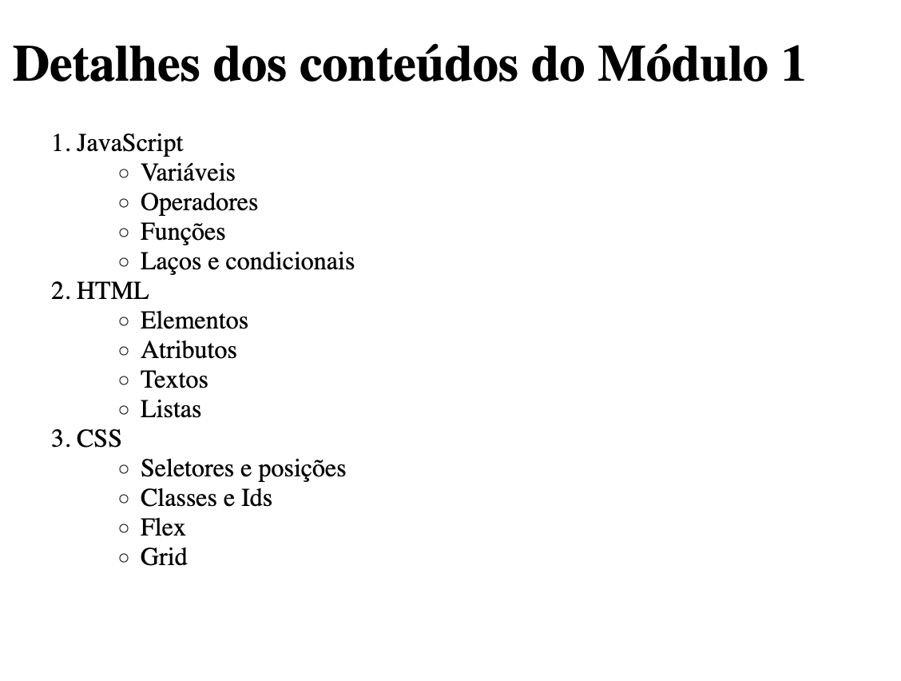

# Exercício 2

Crie um arquivo `exercicio2.html`, e neste arquivo, crie a estrutura de uma página HTML5, com head e body. Adicione o título **Exercício 2**, e crie uma página seguindo o exemplo abaixo:

