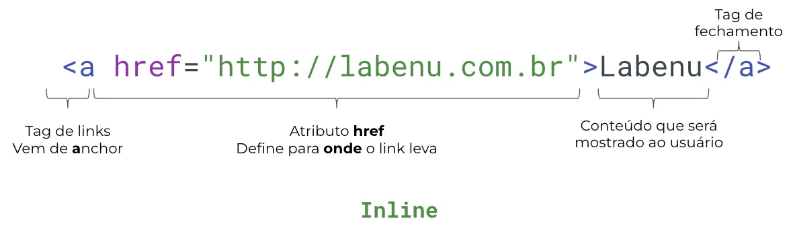
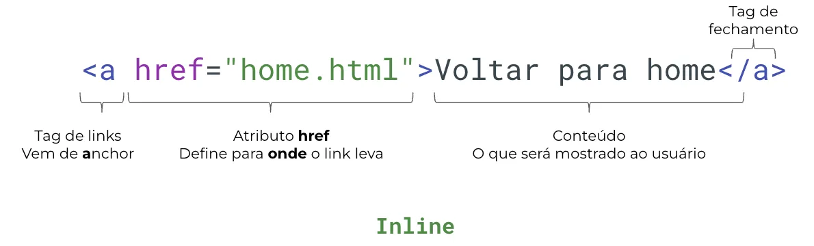
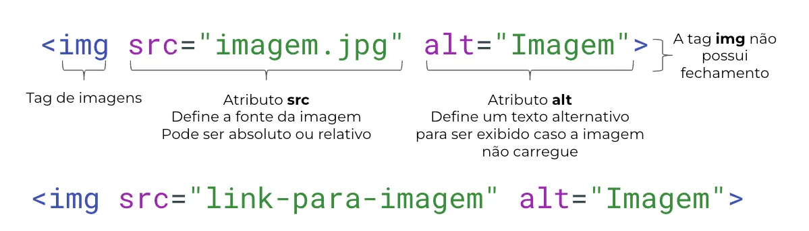

# Tags especiais

Algumas tags do HTML tem funcionamento diferente do que vimos na aula passada. Estas tags adicionam elementos diferentes, e às vezes tem sintaxes levemente diferentes. Vamos dar uma olhada nas mais comuns agora!

## Tag anchor

Tipo: inline

tag: `<a></a>`

Atributos importantes: `href`

Com a tag **a**nchor, podemos fazer um **link** para outros sites, páginas e arquivos. Utilizamos o **atributo** `href` para indicar o **caminho** que aponta o link.





## Tags de mídia

Antes do HTML5, possuíamos apenas a tag `img` como tag de mídia. Como o nome já aponta, esta tag permite que sejam criados elementos de  imagem em nossa página. Agora, temos também as tags `video` e `audio`. Estas tags possuem seu conteúdo guardado no **atributo** **`src`**. 

### `img`

- Tipo: **inline**
- tags: `img`
- Atributos importantes: `src`, `alt`

A tag `img` é uma tag que não possui **fechamento**. Veja os exemplos abaixo.



### Video complementar

[Tags especiais .mp4](https://s3-us-west-2.amazonaws.com/secure.notion-static.com/3d611038-6c15-4837-af4e-1f39d3d28e44/Tags_especiais_.mp4)

### `audio`

- Tipo: **inline**
- tags: `audio`
- Atributos importantes: `src`, `controls`, `autoplay`, `muted`, `loop`

Podemos indicar entre as tags de áudio o que deve aparecer caso o navegador ou a página não consiga exibir o áudio, como faz o atributo `alt` para as imagens.

```html
<audio src="arquivo/link" controls loop>
Seu navegador ou página não suporta a tag audio
</audio>
```

### `video`

- Tipo: **inline**
- tags: `video`
- Atributos importantes: `src`, `controls`, `autoplay`, `loop`, `height`

Podemos indicar entre as tags de vídeo o que deve aparecer caso o navegador ou a página não consiga exibir o vídeo, como no elemento de áudio.

```html
<video src="arquivo/link" controls loop>
Seu navegador ou página não suporta a tag video
</video>
```

Exemplo interativo com as três tags:

https://codepen.io/LabenuDev/pen/NWLErJp

### Video complementar

[Tags especiais 2 .mp4](https://s3-us-west-2.amazonaws.com/secure.notion-static.com/ff21eac7-c62d-4477-a9ae-f2fe63db3310/Tags_especiais_2_.mp4)

## Resumo

1. As tags HTML são códigos que definem elementos em uma página da web, como links, imagens, áudio e vídeo.
2. As tags têm uma sintaxe específica e usam atributos, como **`href`** e **`src`**, para fornecer informações adicionais.
3. Algumas tags, como **`<a>`**, são do tipo **`inline`**, o que significa que elas não quebram a linha na página.
4. Cada tag tem atributos importantes específicos, como **`href`** para **`<a>`** e **`src`**, **`alt`**, **`controls`**, **`autoplay`**, **`muted`**, **`loop`**, e **`height`** para as tags de mídia **``**, **`<audio>`**, e **`<video>`**.
5. Ao utilizar as tags, podemos adicionar diferentes elementos na página, como links para outras páginas, imagens, áudio e vídeo.