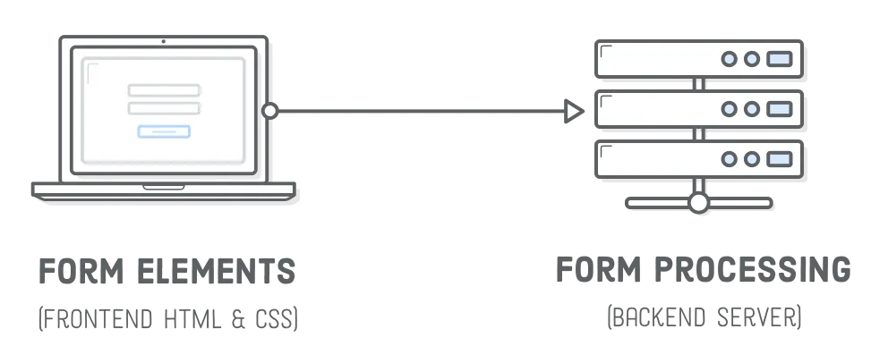
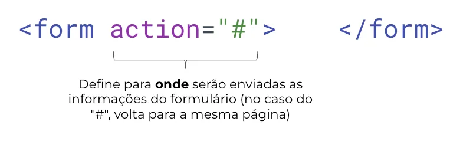
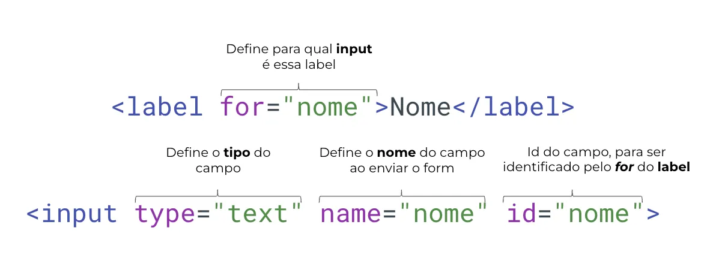
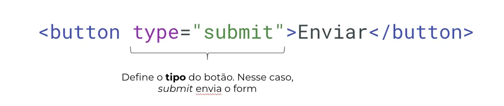

# Formulários

Usamos nossas páginas HTML para **receber entradas** de quem visita nosso site. Formulários de contato, páginas de comentário num post, preenchimento de dados de endereço e cartão num site de compras, são todos exemplos comuns de formulário. São os dados do formulário que serão processados por nossos códigos, e é no HTML que os criamos.

fonte: Interneting is Hard

Existem dois aspectos principais em um form HTML: a interface de usuário e o processamento dos dados. A interface é a *aparência* do formulário (definida a partir do HTML e do CSS), e o processamento dos dados é o código que manipula estas informações. Esta segunda parte será dividida em desenvolvimento **front-end** e **back-end**, e serão vistas com mais detalhes no decorrer do curso.

Por enquanto vamos focar em páginas com processamento **local** dos dados, isto é, feito no nosso navegador de internet, sem nenhuma outra fonte de dados além de nossos códigos. 

Vamos começar a conhecer as tags de formulário no HTML!

### `form`

- tipo: block
- tags: `form`
- atributos importantes: `action`

Temos que começar nosso formulário utilizando a tag **`form`**

### `input` e `label`

- tipo: inline
- tags: `input` e `label`
- atributos importantes: `type`, `name` e `id`, para a tag de `input`, e `for` para a tag de `label`

O campo para **inserir** as informações é representado pela tag **input.** Ele pode vir junto com uma outra tag: **label**. Ela é usada para indicar o que o usuário deve escrever no input em questão.

Para vincular o label ao input, os atributos `for` e `id` devem ter o mesmo valor.

O elemento `input` **não possui tag de fechamento.**

### `button`

- tipo: inline
- tags: `button`
- atributos importantes: `type`

Botões são representados pela tag `<**button>**`:

### Video complementar

[formularios .mp4](https://s3-us-west-2.amazonaws.com/secure.notion-static.com/6d90c656-fac7-46b6-9620-2974cda0cc09/formularios_.mp4)

## Resumo

1. As páginas HTML podem ser usadas para receber entradas de usuários em um site por meio de formulários.
2. Os formulários em HTML têm dois aspectos principais: a interface do usuário(front) e o processamento de dados(front e back).
3. As tags **`form`**, **`input`**, **`label`** e **`button`** são elementos fundamentais para criar um formulário em HTML.
4. É importante utilizar corretamente os atributos das tags, como **`action`** para a tag **`form`** e **`for`**, **`id`**, **`name`** e **`type`** para as tags **`input`**, **`label`** e **`button`**.