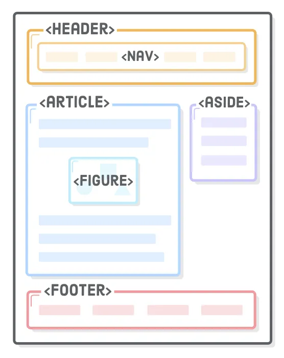

# Tags semânticas

**HTML semântico** e **tags semânticas** referem-se à ideia de que nossa marcação HTML deve deixar explícito o **significado** de cada parte do **conteúdo**.

O HTML5 adicionou diversos elementos que foram criados especificamente para **atribuir significado** ao layout da página. Esses elementos funcionam da seguinte forma:

Nas versões anteriores do HTML, nós tínhamos dois tipos principais de **elemento genérico**, `div` e `span`, que representavam qualquer elemento **block** ou **inline**, respectivamente. Estes elementos geravam alguns problemas de compreensão, pois, por serem genéricos, criavam estruturas ambíguas, o que dificultava o trabalho de **motores de busca** (como o Google), **leitores de tela** como o NVDA, e outros computadores. Ou seja, era difícil entender as diferentes partes do código.

Além disso, tags semânticas nos ajudam, enquanto devs, a manter nosso código organizado, e consequentemente, mais fácil de dar manutenção.

Vamos dar uma olhada em como estas tags funcionam!

<aside>
💡 Todas as tags semânticas que vamos mostrar são **block**, e substituem as **divs**

</aside>

### `header`

Usada para indicar conteúdos introdutórios; cabeçalhos

**Exemplos**: logo da marca, nome, um campo de busca

### `nav`

Usada para indicar seções que permitam que a pessoa usuária navegue pelo site

**Exemplos**: menu com opções

### `article`

Elemento independente da página principal, que pode ser reaproveitado

**Exemplos**: post de um blog, comentários, etc

### `aside`

Elemento não diretamente relacionado com o conteúdo principal.

**Exemplos**: anúncios, outros conteúdos

### `section`

Define uma seção do seu site. Deve ser usada quando queremos unificar vários conteúdos que tenham algo em comum, mas não há uma tag semântica específica. Por exemplo, uma **section** pode abrigar vários **articles** dentro dela.

### `main`

Define o conteúdo principal, contendo diretamente os elementos do tópico central da página.

**Não deve** ser filha de `<article>`, `<aside>`, `<footer>`, `<header>`, ou `<nav>`

### `footer`

Para o final da página, a área de rodapé

**Exemplos**: informações de contato da empresa, FAQ, localização e CNPJ, ou créditos para a equipe que produziu a página.

<aside>
⚠️ **IMPORTANTE:** Apenas usar a tag semântica não garante a formatação. Usar a tag footer, por exemplo, não garante que o conteúdo do elemento vai ficar na parte de baixo da tela. 

É possível, também, que você use as tags semânticas em qualquer lugar (cabeçalho criado dentro de uma aside, menu de opções criado dentro de um footer, por exemplo), mas seu código **não fará sentido**!
Além disso, a experiência da pessoa usuária provavelmente será problemática, especialmente se fizer uso de leitores de tela.

</aside>

<aside>
🚨 **MEGA IMPORTANTE:** você **NÃO** precisa decorar todas as tags, elementos e regras. Você sempre pode consultar os materiais, a internet, o time de ensino e a turma. Um site muito querido pelo time Labenu é o https://htmlcheatsheet.com/

</aside>

### Video complementar

[tags semânticas.mp4](https://s3-us-west-2.amazonaws.com/secure.notion-static.com/350740ea-2638-4f92-8187-c1db97e09cb4/tags_semnticas.mp4)

## Resumo

1. Utilize tags semânticas para deixar explícito o significado de cada parte do conteúdo do site.
2. Aplique as tags semânticas para manter o código organizado e mais fácil de dar manutenção.
3. Evite usar elementos genéricos, como as tags **`div`** e **`span`**, pois eles criam estruturas ambíguas no código.
4. Use as tags semânticas **`header`**, **`nav`**, **`article`**, **`aside`**, **`section`**, **`main`** e **`footer`** para identificar e organizar diferentes partes do conteúdo da página.
5. Lembre-se de que apenas utilizar as tags semânticas não garante a formatação adequada do conteúdo, sendo necessário utilizar CSS para isso. 
6. Evite usar as tags semânticas de forma incorreta, como criar um cabeçalho dentro de uma `<aside>` ou um menu de opções dentro de um footer.