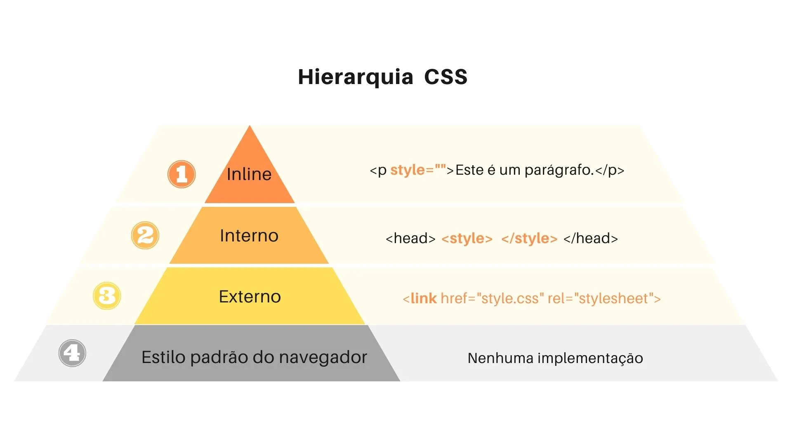

# CSS - Inline, interno e externo

O **CSS**, abreviação de **C**ascading **S**tyle **S**heets (Folhas de Estilo em Cascata), é uma ferramenta essencial para a estilização de páginas web. É responsável por dizer ao navegador como os elementos da página devem ser exibidos.

Para conectar o HTML ao CSS, usamos a tag **`link`**. Essa tag é utilizada na seção **`head`** do documento HTML e tem três atributos principais: 

1. **`href`**, que aponta para o caminho do arquivo CSS; 
2. **`rel`**, que especifica a relação entre o documento atual (HTML) e o documento linkado (CSS), sendo normalmente **`stylesheet`**; 
3. **`type`**, que define o tipo de mídia do documento, com valor padrão **`text/css`**.

Existem três formas de utilizar o CSS em projetos web: 

1. **Inline:** é usado para aplicar estilos a um elemento específico. Ele é colocado dentro da tag HTML do elemento e é separado por um ponto e vírgula.
    
    ```html
    <!--estilização inline-->
    **<p style="color:red;font-size:16px;">Olá</p>**
    ```
    
2. **Interna:**  é usado para aplicar estilos a uma página inteira. Ele é colocado dentro da tag `<head>` do HTML e é cercado por tags `<style>` e `</style>`.
    
    ```html
    <!--estilização interna-->
    
    <head>
    	**<style>
        	p {
            	color: red;
            	font-size: 16px;
        	}
    	</style>**
    </head>
    
    <body>
     <p>Olá</p>
    </body>
    ```
    
3. **Externa:** é usado para aplicar estilos a várias páginas. Ele é salvo em um arquivo separado com a extensão .css e é vinculado ao HTML usando a tag `<link>`.

```html
<!--estilização externa ao arquivo-->
<head>
  <link rel="stylesheet" type="text/css" href="styles.css">
</head>
```

```css
/*Implementação feita dentro do arquivo chamado "styles.css"*/
p{
  color: red;
  font-size: 16px;
}
```



A hierarquia CSS é a ordem em que o CSS é aplicado a uma página. 

1. CSS inline tem a maior prioridade, seguido pelo CSS interno, CSS externo e, finalmente, o estilo padrão do navegador.
2. Se você usar dois ou mais estilos diferentes para um elemento, **o estilo com a maior prioridade será aplicado.**
3. **Se você não usar nenhum dos três tipos** de CSS, o estilo padrão do navegador será usado.

A hierarquia CSS é importante para garantir que seus estilos sejam aplicados na ordem correta. 

<aside>
💡 Recomendamos o uso da forma **externa ao arquivo**, pois é a mais organizada!

</aside>

## Vídeo complementar

[CSSI_-_Inline_interno_e_externo.mp4](https://s3-us-west-2.amazonaws.com/secure.notion-static.com/38a53085-802e-4854-9c65-dc6f83e6678e/CSSI_-_Inline_interno_e_externo.mp4)

# Resumo

1. O CSS é uma ferramenta importante para a estilização de páginas web e é responsável por dizer ao navegador como os elementos da página devem ser exibidos.
2. Para conectar o HTML ao CSS, é utilizada a tag **`link`**, que é adicionada na seção **`head`** do documento HTML e possui três atributos principais: **`href`**, **`rel`** e **`type`**.
3. Existem três formas de utilizar o CSS em projetos web: Inline, Interna e Externa. **É recomendado o uso da forma Externa ao arquivo por ser mais organizada.**