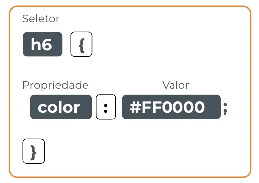

# Seletores simples

Seletores são a base da sintaxe do CSS. Os seletores definem os elementos HTML em que o estilo é aplicado. Abaixo, a estrutura de como funciona um seletor:



# S**eletores simples**

Os **seletores simples** permitem identificar um elemento diretamente ou todos os elementos daquele tipo.

Por enquanto, falaremos de 4 tipos de seletor:

- tags
- class
- id
- universal `*`

## Tags

O seletor de tag estiliza todos os elementos HTML que correspondem àquela tag. Por exemplo, o seletor **`div`**estiliza todas as **`divs`**no documento HTML.

```css
div {
		background-color: red;
   	border: 1px solid black;
}
```

## Class

O seletor de classe permite atribuir uma classe aos elementos e **estilizar todos os elementos que possuem aquela classe**. Para definir uma classe no CSS, comece com um ponto seguido pelo nome da classe. Por exemplo, o seletor **`.texto-primario`**estiliza todos os elementos que possuem a classe **`texto-primario`** definida em seu HTML

```html
<p class="texto-primario">Texto Bonito</p>
```

```css
.texto-primario {
		color: green;
   	border: 1px dotted black;
}
```

## Id

O seletor de id estiliza apenas um elemento específico, que deve ter um ID único e significativo no documento HTML. Para definir um seletor de ID no CSS, comece com um "#" seguido pelo nome do ID. Por exemplo, o seletor **`#texto-unico`**estiliza apenas o elemento com o ID **`texto-unico`**.

```html
<p id="texto-unico">Texto Unico</p>
```

```css
#texto-unico {
		color: blue;
   	border: 3px double orange;
}
```

Na hierarquia dos seletores CSS, a força dos seletores segue a ordem de tags, classes e ids, onde as tags são a menos fortes e os ids são os mais fortes.

<aside>
⚖️ tags ⇒ classes ⇒ ids

</aside>

Podemos adicionar quantas tags, classes e ids quisermos em nossos arquivos `.css`, e estes podem possuir quantas propriedades quisermos.

## Seletor universal `*`

Permite atribuir um conjunto de regras de estilização para todos os elementos do documento HTML. Por exemplo, o seletor **`*`** pode ser usado para zerar todas as margens e preenchimentos de todos os elementos no documento:

```css
* {
		margin: 0;
		padding: 0;
}
```

<aside>
💡 É importante lembrar que as regras definidas em seletores específicos (tags, classes ou ids) têm mais prioridade do que as regras definidas no seletor universal **`*`**. Ou seja, se uma regra específica for definida em um elemento, ela irá sobrescrever a regra do seletor **`*`**.

</aside>

## Video complementar

[CSS1_-_Seletores.mp4](https://s3-us-west-2.amazonaws.com/secure.notion-static.com/afd77e76-2bd8-45ca-8df7-336d749841ed/CSS1_-_Seletores.mp4)

# Resumo

1. Os seletores são a base da sintaxe do CSS e definem os elementos HTML em que o estilo é aplicado.
2. Existem quatro tipos de seletores simples CSS: tags, classes, ids e o seletor universal`*`. Ao atribuir estilos a classes e ids, é importante escolher nomes significativos e únicos para evitar conflitos.
3. Na hierarquia dos seletores CSS, os ids têm mais força do que as classes, que têm mais força do que as tags.
4. Embora o seletor universal `*` permita estilizar todos os elementos, é importante lembrar que regras específicas de um elemento têm mais força do que as regras do seletor universal.