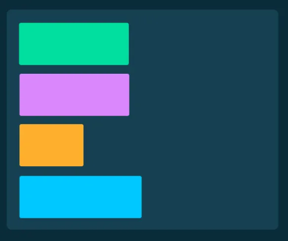
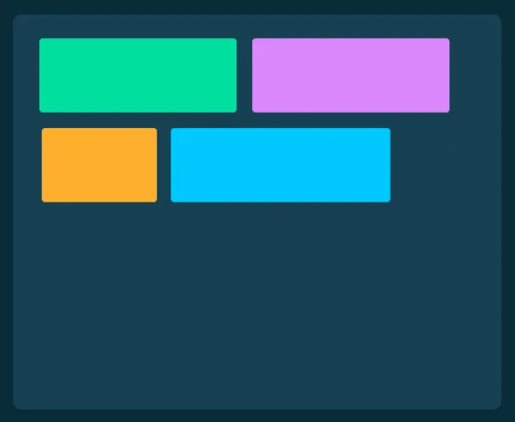
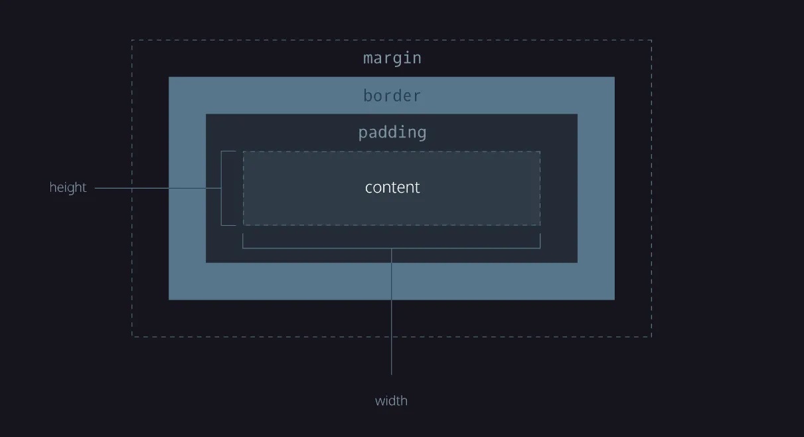

# Propriedades: O box model

No CSS, existem diversas propriedades disponíveis. Nesta seção da aula, abordaremos a propriedade **`display`** e as cinco propriedades que compõem o que chamamos de **box-model**:

1. height;  
2. width;
3. margin;
4. padding;
5. border;

<aside>
💡 É importante lembrar que **ninguém consegue saber todas as propriedades CSS de cor**. Sempre podemos (e devemos!) consultar algum material externo para lembrar da sintaxe exata. Aqui no curso, mostraremos as mais comuns!

</aside>

## **A propriedade "display"**

A propriedade **`display`**permite especificar o comportamento de renderização de um elemento. Existem algumas possibilidades. Por enquanto, abordaremos três delas:

- `block`
- `inline`
- `none`

Tanto **`block`**quanto **`inline`**são termos que já vimos nas aulas de HTML. Utilizando o CSS, podemos alterar o comportamento padrão dessas tags.

**`display: block`**

Essa propriedade faz com que o elemento **ocupe toda a largura disponível** e comece em uma **nova linha.**



**`display: inline`**

Essa propriedade faz com que o elemento **ocupe apenas a largura necessária** e **não inicie uma nova linha.**



**`display: none`**

Essa propriedade faz com que o elemento não seja exibido na tela.


## Video complementar

[CSS1_-_Box_Model__display.mp4](https://s3-us-west-2.amazonaws.com/secure.notion-static.com/4961f4cd-f926-40c7-9b9c-6ec8d00ea0bc/CSS1_-_Box_Model__display.mp4)

# O **box-model**

### Height e Width

As propriedades height e width definem a **altura** e a **largura** dos elementos em CSS. O valor padrão dessas propriedades é baseado no tipo de display que os elementos possuem. Elementos com display **`block`**possuem largura igual ao total de largura disponível na tela e altura igual aos limites do elemento que criamos. Já elementos com display **`inline`**possuem altura e largura iguais ao espaço que ocupam. Existem diversas unidades de medida para altura e largura, mas a mais comum é o **pixel** `px`.

## Video complementar

[CSS1_-_Box_Model__Width_e_Height.mp4](https://s3-us-west-2.amazonaws.com/secure.notion-static.com/3f22ab25-7860-4a76-ad37-a71fe16176ab/CSS1_-_Box_Model__Width_e_Height.mp4)

## Margin

A propriedade **margin** representa o espaço que o elemento terá ao seu redor, ou seja, o espaço entre o elemento e outros elementos da página.

```css
div {
		margin-top: 5px;
		margin-bottom: 6px;
		margin-left: 10px;
		margin-right: 8px;
}
```

## Border

A propriedade **border** adiciona bordas ao elemento, permitindo especificar estilo, largura e cor da borda.

```css
div {
		border-top: 1px solid black;
		border-bottom: 6px;
		border-left: 10px;
		border-right: 8px;
}
```

## Padding

A propriedade **padding** cria um espaço entre o conteúdo dentro do elemento e sua borda. Em outras palavras, ela faz com que o conteúdo se distancie da borda.

```css
div {
		padding-top: 5px;
		padding-bottom: 6px;
		padding-left: 10px;
		padding-right: 8px;
}
```

Chamamos este conjunto de propriedades de **modelo de caixa(Box model)**, e ele tem esta estrutura:



fonte: codecademy

## Video complementar

[CSS1_-_Box_Model___Margin_Padding_e_Border.mp4](https://s3-us-west-2.amazonaws.com/secure.notion-static.com/1ccddd37-d81a-44f4-8a51-72bd4e5280de/CSS1_-_Box_Model___Margin_Padding_e_Border.mp4)

## Extra: abreviações

No CSS, temos sintaxes que permitem colocar os mesmos valores para **top-bottom** (topo-base) e para **right-left** (direita-esquerda)**.** O primeiro argumento é para a **vertical** e o segundo para **horizontal.**

```css
div {
		margin: 10px 5px;
}
/*neste exemplo, div tem 10px de margem para cima e para baixo,
e 5px de margem dos lados*/
```

Há também uma sintaxe que permite colocar valores diferentes **em todas as direções:**

- A ordem das margens é: **top, right, bottom, left** (sentido horário: topo, direita, base, esquerda);

```css
div {
		margin: 10px 5px 8px 20px;
}
/*neste exemplo, div tem 10px de margem para cima, 5 à direita, 8 para baixo
e 20 à esquerda*/
```

## Video extra

[CSS1_-_Box_Model___Extra.mp4](https://s3-us-west-2.amazonaws.com/secure.notion-static.com/81143254-3bca-4dc5-b688-707e920f306a/CSS1_-_Box_Model___Extra.mp4)

## Resumo

1. **Propriedade "display":** permite definir o comportamento de renderização de um elemento no CSS. Os valores `block`, `inline` e `none` são comuns.
2. **Height e Width:** definem a altura e largura dos elementos em CSS. O valor padrão depende do tipo de display (`block` ou `inline`).
3. **Margin:** propriedade que representa o espaço ao redor do elemento, ou seja, o espaço entre ele e outros elementos da página.
4. **Border:** adiciona bordas ao elemento, permitindo especificar **estilo**, **largura** e **cor da borda**.
5. **Padding:** cria um espaço entre o conteúdo dentro do elemento e sua borda, ou seja, faz com que o conteúdo se **distancie da borda**. 
6. O conjunto de propriedades **`width`**, **`height`**, **`padding`**, **`border`**, e **`margin`** é chamado de **“box model”**.