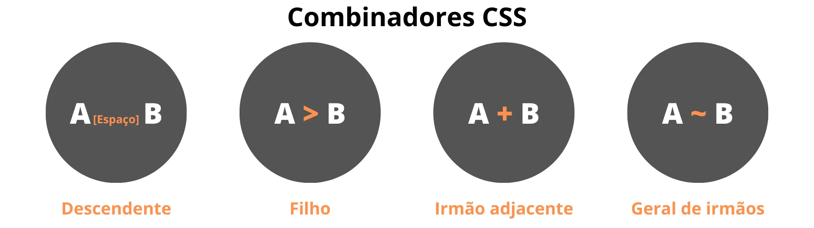

# Seletores compostos, agrupados e combinadores

No CSS, podemos utilizar seletores compostos, agrupados e combinados para evitar repetições de código e aplicar estilos a múltiplos elementos de uma vez. 

# Seletores compostos

Um seletor composto é uma **sequência de seletores simples (tag, id, class, universal)** que não são separados por um combinador e **representa um conjunto de condições simultâneas** em um único elemento. Com seletores compostos podemos especificar ainda mais o nosso seletor. 

Por exemplo, podemos aplicar uma regra a todos os elementos **`h1`** com a classe **`texto`**:

```css

h1.texto {
    color: green;
   	border: 1px dotted black;
}
/*Isso significa que o CSS será aplicado a todos os elementos "h1" 
que também tenham a classe "texto".*/
```

## Agrupamento de seletores

Podemos aplicar a mesma regra para mais de um seletor, **separando-os por vírgula**. Por exemplo, o seguinte código será aplicado a todos os elementos **`h2`**, **`h3`** e **`h4`**:

```css
h2, h3, h4 {
    color: green;
    background-color: orange;
}
```

- Exemplo no **Codepen**
    
    https://codepen.io/jvalves-labenu/pen/yLjejyE
    

# **Combinadores no CSS**

**Combinadores são símbolos** usados no CSS para combinar seletores e especificar a relação entre eles. Eles são usados para selecionar elementos HTML específicos e aplicar estilos a eles.



## Descendentes

Com os combinadores de descendentes, podemos estilizar todos os elementos de um determinado tipo que estão dentro de outro. Para isso, **separamos os dois por um espaço em branco**. Por exemplo, o seguinte código estiliza todos os elementos **`p`**que estão dentro de uma **`div`**:

```css
**div p** {
		color: green;
}
```

- Exemplo no **Codepen**
    
    https://codepen.io/jvalves-labenu/pen/XWqXZYM
    

## Filho

Com os combinadores de filhos, podemos aplicar a estilização apenas aos filhos diretos de um elemento, sem afetar os demais. Para isso, usamos o operador **`>`**(sinal de maior).

```css
div > p {
		color: green;
}
```

- Exemplo no **Codepen**
    
    https://codepen.io/jvalves-labenu/pen/VwxeQBd
    

## Irmão Adjacente

O seletor irmão adjacente ( **`+`** )é uma ferramenta usada para escolher um elemento que está **diretamente após outro elemento específico**.

Para que esse seletor funcione, **os elementos irmãos precisam ter o mesmo "pai"** e o adjetivo "adjacente" significa que eles estão um ao lado do outro, sem nenhum outro elemento no meio.

**Vejamos um exemplo prático baixo:** 

Se tivermos vários elementos `<div>` e, logo em seguida, um elemento `<p>`, o seletor irmão adjacente nos permitirá selecionar apenas o primeiro elemento `<p>` que vem diretamente após qualquer um dos elementos `<div>`.

- Exemplo no **Codepen**
    
    https://codepen.io/LabenuDev/pen/OJaZLMK
    

## Geral de irmãos

O seletor geral irmão( **`~`** ) é usado para selecionar todos os elementos irmãos que vêm após um elemento específico, independentemente de estarem diretamente adjacentes ou não.

- Ao contrário do seletor irmão adjacente, o seletor geral irmão não requer que os elementos irmãos tenham o mesmo elemento pai.
- Ele selecionará todos os elementos irmãos que ocorrem depois do elemento de referência, independentemente de sua hierarquia ou estrutura.
- Exemplo no **Codepen**
    
    https://codepen.io/LabenuDev/pen/wvQjwda
    

## Video complementar

[CSS_2_-_Combinadores.mp4](https://s3-us-west-2.amazonaws.com/secure.notion-static.com/7e06ff5f-cd09-4db2-b35c-813702938df4/CSS_2_-_Combinadores.mp4)

## Resumo

| Tópico | Descrição | Exemplo |
| --- | --- | --- |
| Seletores compostos | Sequência de seletores simples que representam condições simultâneas em um único elemento. | `h1.texto` |
| Agrupamento de seletores | Aplicação da mesma regra a mais de um seletor, separados por vírgula. | `h2, h3, h4` |
| Descendentes | Estilização de todos os elementos de um determinado tipo que estão dentro de outro, separados por um **`espaço em branco**.` | `div p` |
| Filhos | Estilização apenas dos filhos diretos de um elemento, usando o operador `>` (sinal de maior). | `div > p` |
| Irmão Adjacente | Seleção de um elemento que está diretamente após outro elemento específico. Os elementos irmãos devem ter o mesmo elemento pai. Usamos o operador **`+`** . | [Exemplo no Codepen](https://codepen.io/LabenuDev/pen/OJaZLMK) |
| Geral de irmãos | Seleção de todos os elementos irmãos que vêm após um elemento específico, independentemente de estarem diretamente adjacentes ou não. Não requer que os elementos irmãos tenham o mesmo elemento pai. Usamos o operador **`~`** . | [Exemplo no Codepen](https://codepen.io/LabenuDev/pen/wvQjwda) |