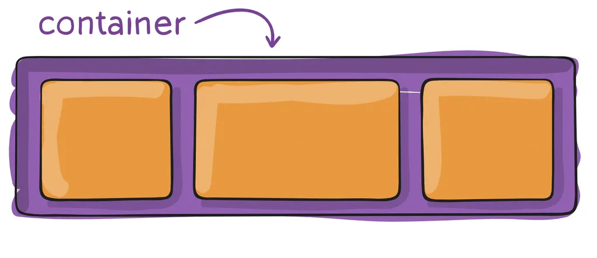

# Flex - Introdução

# **Flex, Grid e contêineres**

Para começar, vamos relembrar um pouco da nossa segunda aula de HTML. Nela, dissemos que antes do HTML5, utilizavam-se somente **`divs`** para dividir conteúdos e **`classes`** para estilizá-los, sem contar com a compreensão do próprio computador para “*entender*” o HTML.

🧠 Construir um HTML semântico tem a ver com a **escolha correta de tags** para determinados **objetivos**.

<aside>
💡

Por exemplo: a tag **`<header>`** deve ser usada para alocar o cabeçalho da aplicação, a tag **`<footer>`** para alocar o rodapé e assim por diante.

</aside>

No entanto, vimos que apenas utilizar as tags semânticas **não é suficiente** para que a disposição dos elementos seja feita na nossa página.

Uma tarefa muito importante no **`CSS`** é **dispor elementos na tela** de uma determinada maneira. São tarefas do CSS, por exemplo:

- Centralizar elementos
- Posicionar Header e Footer
- Posicionar Menu lateral
- Posicionar Cards com informações

Como sabemos, alguns elementos HTML são **`block`** e outros são **`inline`**. Vimos nas aulas de CSS que esta definição é dada pela propriedade **`display`**.

No entanto, as formas antigas de posicionar elementos na tela não eram muito intuitivas. As mais comuns eram **position** (que já vimos por aqui), e **float** (uma maneira mais antiga, e menos recomendada. Caso queira saber mais sobre ela, clique [**aqui**](https://developer.mozilla.org/pt-BR/docs/Web/CSS/float)). Ou ainda, utilizando a tag **`table`** (encontrada apenas em páginas muito antigas).

# **Contêineres**

No CSS, algumas tags são consideradas "contêineres", ou seja, são tags que normalmente receberão outras tags aninhadas. Alguns exemplos são:

- **`
`**: pode conter outras **`div`**, **`span`**, **`img`**, entre outros elementos.
- **``**: pode conter **`p`**, **`img`**, **`audio`**, **`video`**, entre outros elementos.
- **`<header>`**: pode conter **`h1`** a **`h6`**, **`img`**, **`span`**, entre outros elementos.
- **`<main>`**: pode conter **`article`**, **`section`**, **`nav`**, **`span`**, entre outros elementos.
- **`<footer>`**: pode conter **`h1`** a **`h6`**, **`img`**, **`span`**, **`p`**, entre outros elementos.

Para resolver a dificuldade em posicionar elementos, foram criados dois novos valores para a propriedade **`display`**: **Flex** e **Grid**. Ambos são utilizados para **posicionar elementos (itens)** que estão **dentro** (ou seja, são filhos diretos) de um **contêiner**.

fonte: CSS-Tricks

No código, temos algo como isso:

E a seguinte separação:

**Container (pai):**

- Bloco (`div`, `span`, `header` e etc) que será a **base** do layout, ele **agrupa os itens** que desejamos manipular para que eles tenham apenas 1 pai em comum.

**Itens (Filhos):**

- Elementos posicionados dentro do container que podem ser **qualquer** tag HTML.
- Somente **filhos diretos** são afetados pelas propriedades do **Flex** e **Grid**.

Dito isso, bóra começar falando sobre os **contêineres**!

<aside>
💡 Importante: neste conteúdo veremos diversas propriedades de valores para itens e contêineres. **NÃO SE PREOCUPE EM DECORAR TODAS!**

Se não se lembrar o que cada uma faz, basta pesquisar no google ou testar no seu próprio código. Caso queira ver ainda mais usos, recomendamos este link [**aqui**](https://origamid.com/projetos/flexbox-guia-completo/)

</aside>

# Resumo

1. A escolha correta de tags para determinados objetivos é fundamental para construir um HTML semântico.
2. Utilizar apenas tags semânticas não é suficiente para dispor elementos na página de maneira desejada.
3. Contêineres, como **`
`**, **``**, **`<header>`**, **`<main>`**, e **`<footer>`**, são tags que normalmente receberão outras tags aninhadas.
4. Flex e Grid são valores para a propriedade **`display`** no CSS que ajudam a posicionar elementos (itens) dentro de um contêiner.
5. Não é necessário memorizar todas as propriedades de valores para itens e contêineres, é possível pesquisar no Google ou testar no código