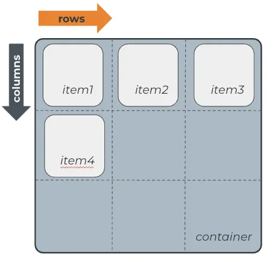

# Grid - Estrutura

Como vimos na aula de Flex, novas estruturas de `display` foram criadas para facilitar a diagramação de páginas na web com HTML e CSS.

Outra coisa que vimos naquela aula, foi que o flex funciona com uma relação de **container→itens**. 

A estrutura que veremos hoje, o Grid, funciona da mesma forma, mas com uma diferença principal: o Grid é uma forma de organização **bidirecional**, com as dimensões vertical e horizontal definidas, numa grade estilo excel. Além disso, Flex e Grid podem ser usados juntos sem problema nenhum!

<aside>
💡 **Importante:** 
Neste conteúdo veremos diversas propriedades de valores para itens e contêineres. **NÃO SE PREOCUPE EM DECORAR TODAS!**

Se não se lembrar o que cada uma faz, basta pesquisar no google ou testar no seu próprio código. Caso queira ver ainda mais usos, recomendamos este link [**aqui**](https://www.origamid.com/projetos/css-grid-layout-guia-completo/)

</aside>

Então bora começar a falar do Grid, começando pelo seu formato. O grid possui o eixo das linhas (*rows*) e o eixo das colunas (*columns*). Assim como no Flex, apenas os elementos imediatamente contidos no contêiner são afetados.

Para começar a trabalhar com grid, devemos passar `display: grid` para o elemento que será o **contêiner** do nosso grid. Depois disso, precisamos definir quantas `linhas` e quantas `colunas` queremos. No nosso exemplo abaixo, temos três colunas e três linhas.

## Video complementar

[Grid x Flex.mp4](https://s3-us-west-2.amazonaws.com/secure.notion-static.com/2ad7283d-3e24-4224-8a7d-37e7fb11d5ab/Grid_x_Flex.mp4)

# Resumo

- Grid também funciona com uma relação de **container→itens**
- Grid funciona de forma bidirecional, com dimensões vertical e horizontal definidas, como uma grade estilo excel.
- Flex e Grid podem ser usados juntos sem problemas.
- Para trabalhar com Grid, é preciso definir **`linhas`** e **`colunas`**, passando **`display: grid`** para o elemento que será o contêiner.
- Não é necessário decorar todas as propriedades de valores para itens e contêineres, basta pesquisar no Google ou testar no próprio código.